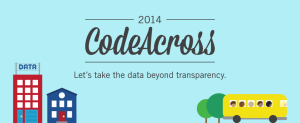

The Tulsa Community Joins Together for Weekend of Civic Innovation: Feb 22-23

Co-produced by Code for Tulsa, Civic Ninjas and TU’s Student Chapter of the Association for Computing Machinery (ACM), the event will focus on taking government data and using it to enhance the community. This event is co-hosted by Code for America, Sunlight Foundation, and Open Knowledge Foundation -- one of 45 events happening around the globe this weekend as part of CodeAcross. Sponsorship for this event is provided by Fab Lab Tulsa, and Tulsa Web Devs.

This weekend, a local group of community-minded technologists, organizers, students, and volunteers are joining together to work on projects using Tulsa’s published list of open city data.

This event is part of CodeAcross -- an international weekend of locally held events. There are 45 events being held in communities around the globe. Each event is unique, but all share the theme of “Let’s take the data beyond transparency” -- and focus on using data to enhance communities.

“We view this as a new way to understand, and get engaged with local government. The city needs more input from citizens and more people involved in solving problems. By opening this data, the City of Tulsa invites citizens to work together to create a better city. This is a great opportunity to roll up your sleeves and get involved,” said Code for Tulsa volunteer Carlos Moreno.

**WHO: **Code for Tulsa, and the TU Association for Computing Machinery (ACM)

**WHEN: **8:30am-9:30am at Fab Lab on February 22, 10am-9pm at TU on February 22 & 23

**WHERE: **Fab Lab Tulsa. 710 S Lewis Ave.; Tulsa University Mayo Village Student Activities Center\*\*\*\*

CodeAcross is organized by Code for America (CfA), the Sunlight Foundation, and the Open Knowledge Foundation and is sponsored by Esri and Microsoft. This is the third annual CodeAcross.

CodeAcross is open to any person and any municipality or community: big, or small, beginner or expert. Last year 22 communities participated in CodeAcross. Events are designed to promote civic engagement and collaboration between local governments and citizens – and to put the vast amount of data cities collect and house to good use. February 22, 2014 is International Open Data Day.

“CodeAcross is an opportunity for citizens to participate in building stronger, more open and engaging governments where they live, but also to be connected to a global network of citizens who are doing the same thing around the world,” said Catherine Bracy, Code for America’s director of community organizing. “The goal is to build long-lasting communities who can collaborate with their governments to make cities work better.”

Established in 2011, Code for Tulsa is a group of citizens who want to use technology to make life better in Tulsa. In May 2013, the Tulsa City Council and Mayor of Tulsa adopted the Open and Accessible Data Resolution, with direction to provide more data online and work toward a higher level of transparency and civic engagement. Code for Tulsa projects thus far include a dispatch system for the Tulsa Fire Department, the Tulsa Road Information Feed, and the Oklahoma Boundary Service, a map-based system whereby anyone can enter their address and get instant information about local & state government elected representatives, as well as voting precinct and data such as school district and census tract.

RSVP: [meetup.com](http://www.meetup.com/Code-for-Tulsa/events/152233562/)

Full list of events: [codeforamerica.org](http://codeforamerica.org/codeacross)

{/*  */}
[meetup](http://www.meetup.com/Code-for-Tulsa/events/152233562/)
