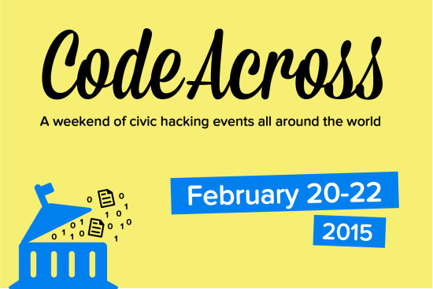

<!--  -->

This weekend Code for Tulsa hosted one of 60 CodeAcross events (#codeacross) around the globe. At the Flyloft in Tulsa’s Brady Arts District, Code for Tulsa members worked on five tech initiatives for the community of Tulsa.

Inspired by a talk from Jacob Solomon at last year’s Code for America national summit, Code for Tulsa leapt at the opportunity to help make Tulsa a more empathetic city for its citizens and, ultimately, a more welcoming, friendly and empowering place to live. CodeAcross projects address disaster preparedness, Tulsa’s food deserts, the SNAP program and accessibility to city information.

<!--  -->

## Oh, SNAP!

One group spent the weekend developing two apps which help out recipients of SNAP benefits. They created an app which helps SNAP recipients remember important benefit renewal dates and to update important info, such as any change of address or job, or if they get a raise. It’s easy to forget these infrequent events.

When forgotten, problems arise for the recipient and for the DHS system. On the recipient end, of course, the end of benefits means nothing to eat until the problem is resolved. At the DHS office, case workers have a ton of paperwork for any new or lapsed recipient. A reminder system will cut down on the amount of time these case workers have to spend redoing work for existing clients and can then focus on new folks in need.

Also, an app is under development which will help potential clients of SNAP determine if they are, in fact, eligible for assistance. The current application process is cloudy, broken and difficult to navigate. It frustrates those it needs to help. It keeps people out of the system instead of funneling appropriate clients into the system for assistance.

This new app will help people know with more certainty if they are likely to be eligible for benefits. This will help them feel more comfortable about navigating the murky waters of the official application.

<!--  -->

## Food On The Move

Taylor Hanson attended the event as well, spearheading an effort aimed at relieving Tulsa’s food deserts. Large areas of town are devoid of locations to pick up healthy food. With a grocery store nowhere in sight, residents of these neighborhoods must travel huge distances to get their food. Often these folks can’t easily get to distant areas of town. They may not have a car. Their work schedules might not line up with the Tulsa Transit schedule, making trips to the grocery store difficult to pull off.

Hanson is empowering a community-driven effort to bring food to the people of these food deserts. Using the tech developed at CodeAcross, Hanson’s “Food on the Move” initiative will be able to track health habits of the people they reach. They’ll know who they’re reaching, when and where. With the data accumulated by the new app, Food on the Move will be able to refine and focus its efforts. Over time, the assistance and community building Food on the Move provides will become more efficient and effective.

<!--  -->

## Citizen Power Brigade

A group called Civic Ninjas was invited by the White House and FEMA to participate in a hack-a-thon last year. The Ninjas decided to work on the problem of mobile power during a disaster.

When nature turns ugly, citizens are often without power for extended periods. After 24 hours or so, any of their electronics they may have needed, from phones to refrigerators, will be dead. Unable to contact friends and family, victims of the weather can feel helpless. While a more affluent family will find the loss of all the food in their fridge annoying, a less fortunate family will be devastated by the loss of so much food.

Enter the Citizens’ Power Brigade. Using a duffel bag-sized converter and a cable, any hybrid car can be used as a mobile power station in an emergency. The effects are much larger than one might expect.

One tank of gas in a hybrid car translates to 8400 phones being charged over one week. That’s twelve million minutes of talk time which wouldn’t otherwise have been available. If the streets are clear enough to make moving the car possible, one hybrid car can circulate through a neighborhood, powering any fridge for two hours. If a refrigerator is able to operate for two hours out of any 24, the food inside can be saved. Families in impoverished areas can avoid significant financial issues with this one hack.

It is even possible, depending on how the technology is used, for one hybrid car to keep one small business up and running for a while, so local grocers could remain open to the public during the immediate aftermath of a catastrophe.

The Power Brigade was introduced in Red Hook Brooklyn last year to great response from that community, one of the most heavily damaged during Hurricane Sandy. This weekend the Brigade is developing software that can help locate hybrid cars and other sources in the wake of a disaster.
<!-- 
 -->

## Open Data Census

At this writing Tulsa is ranked 23rd most user-friendly city in the US by the US City Open Data Census. Code for Tulsa hopes to improve our standings by reporting back to the city government on precisely what information is or isn’t available to the citizenry and how to make city data more open.

Two issues arise. One the one hand, the question is “Can you find the info?” On the other, “Is the info machine-readable?” If the information one wants is available on the website, that’s good. But if the info is in a pdf or other non-machine-readable form, developers cannot use the information in web or mobile applications.

Michael Dellinger, Chief Information Officer of the City of Tulsa, met with Code for Tulsa, encouraging the group to find out how the city can improve the usability of its data. During CodeAcross 2015, members scoured the City of Tulsa web presence to find out exactly what information is shared, how exactly it is shared and creating methods to make the data more useful to developers and citizens in general.

Alongside the Open Data Census is the Digital Service Census, which measures how easily a person using a city website can accomplish various common tasks, like applying for a job or getting a license to start a new business. Again, Code Across 2015 participants accumulated info on how easily these tasks could be done. A report on the user-friendliness of Tulsa will be presented to CIO Dellinger and the city IT department later this month.
<!-- 
 -->

CodeAcross 2015 volunteers spent most of their time at their keyboards coding away, but occasionally needed to stretch their legs. A mini drone was on hand to entertain the gang during these breaks. In all, about 50 people participated in CodeAcross 2015 here in Tulsa, including 15 University of Tulsa ACM students, plus out-of-towners from places as far away as Kansas and Jenks.

(To see the talk by Jacob Solomon which inspired Code for Tulsa’s 2015 work, [click here](https://www.youtube.com/watch?v=yViYA8IG36U).)
