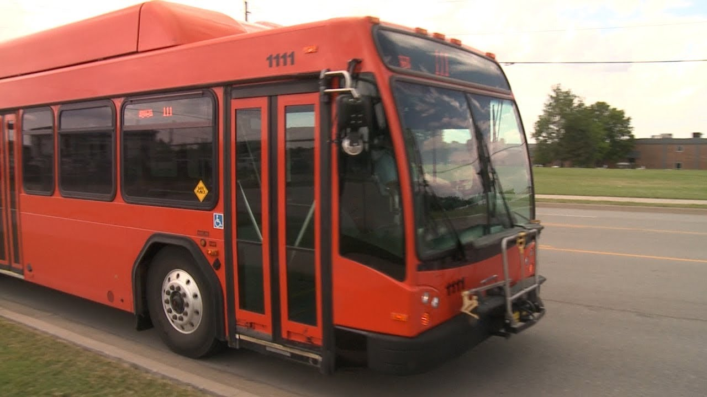

The #TPSRides program enables high school students free access the city transit system while blending in a technology-driven trip planning application. Beginning with the 2016-17 school year, students will use their student ID to access the transit system for free. But perhaps more importantly, the technology developed through a partnership with Code for Tulsa delivers individualized step-by-step trip planning information to ensure every high school student has the tools they need to get to school, part-time jobs and after-school activities.

The #TPSRides program was conceived by Tulsa Public Schools in March 2016 as a response to a budget crisis due to state revenue failures. High truancy rates at Tulsa Public Schools has led the district to consider transportation options for high school students that allow them to have multiple options for getting to school even if they miss the school bus. As the Tulsa Public School district searched for ways to reduce costs and cut truancy rates, an idea emerged to offer the existing transit system as an optional alternative to the school bus for the 2016-2017 school year.

Tulsa Public Schools and Tulsa Transit found that many students were not familiar with using the bus, and so in addition to having the opportunity to ride the bus for free using their student ID, Code for Tulsa developed, *Know Your Ride*, teaching students how to use the transit system using Google Maps on their smartphone.

For two generations, public transit has been seen as a “mode of last resort” for Tulsans who have exhausted all other transportation options. Before #TPSRides, Tulsa Public Schools had never encouraged students to use the existing transit system. The program has the potential to create a new generation of transit riders who don’t need to own a car to be productive residents of the city.

**Read the case study [https://icma.org/documents/tpsrides-partnership-unifying-transit-students-and-technology-case-study](here).**

**[https://modustulsa.org/](Learn more about Modus).**
