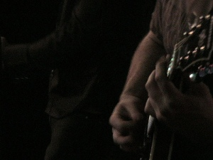

You know what? I admit it. I no longer know as much as I'd like about bands in Tulsa. For example, I had never heard of [The Way It Was](http://www.tulsawiki.org/The_Way_It_Was "The Way It Was"), until my coworker, Nick, started writing about them. He says band members have been involved in the Tulsa DIY/underground music scene for more than a decade. Apparently my unhip-ness goes way back.

{/*  */}

Sadly, there are a lot of things about [bands](http://www.tulsawiki.org/tags/band "TulsaWiki Band Tag") and [live music](http://www.tulsawiki.org/tags/livemusic "TulsaWiki Live Music") in Tulsa I don't know. Luckily, you all have a chance to right this wrong. But don't do it for me, do it for Tulsa!

Go, now, as quick as you are able, and start adding your favorite Tulsa-area bands to the TulsaWiki. I know some of you are _in_ bands, so it behooves you to start wiki-ing. Be sure to tag your page with "Band."

1. If you haven’t already, [create your account](http://www.tulsawiki.org/Users/register/ "Create a TulsaWiki account"). If you have a TulsaWiki account, [log in](http://www.tulsawiki.org/Users/login/ "TulsaWiki login") so you’ll get credit for your edits.
2. At the top of the wiki, use ‘Search or create page’ to look for your favorite Tulsa band.
3. If it’s already on the wiki, use the ‘Edit’ button to add your own expertise to the page. If it isn’t on the wiki, create it by clicking "Create this page."
4. Write about your band. Get bonus points for uploading and adding any pictures you have of the band by clicking the image button (see right) {/**/} . Images should be licensed under [Creative Commons](http://creativecommons.org/licenses/by/3.0/ "Creative Commons"). Click "Save Changes" when you're done.
5. At the bottom of the page, there is an "Edit tags" button. Add the "[Band](http://www.tulsawiki.org/tags/band "TulsaWiki band tag")" tag, as well as any others that you think would be useful.

Wiki this now, \_and \_plan to join us for Tulsa’s [National Day of Civic Hacking](https://ndochtulsa.eventbrite.com/ "NDOCH  registration"). Register now!
