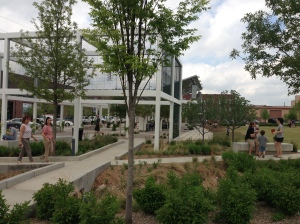

First things first! National Day of Civic Hacking is this Saturday, June 1!

Now, on to Wiki Wednesday!

Wednesdays are special. Wiki Wednesday, Food Truck Wednesday at Guthrie Green...You have plenty of enjoyable ways to make it through the middle of the week!

As you make your way through Brady this week for food trucks, art, music, or the many other diversions there, take some pictures and compose some content, because our theme this week is the [Brady Arts District](http://tulsawiki.org/tags/bradyartsdistrict "Brady Arts District tags"). Think about your favorite haunts in the area where you have in-depth knowledge, and then share it on the TulsaWiki.

If you think "I don't get over to the Brady Arts District much, so I can't think of anything to write," then it's time you visit! This historic neighborhood has enjoyed tremendous revitalization over the past several years. [Guthrie Green](http://tulsawiki.org/Guthrie_Green "Guthrie Green") offers an urban green space, a performance area, a [splash pad](http://tulsawiki.org/tags/splashpad "Splash Pad tags"), Lucky's on the Green, and many free events. [First Friday Art Crawl](http://tulsawiki.org/search/?q=First+Friday+Art+Crawl "First Friday Art Crawl") (if you're first, you can create that page on the wiki!) is a great chance to check out the many galleries in the area (and if you go to the June 7 art crawl, yes, you can still add your wiki articles).

But, enough blog post--it's your turn to write!

1. If you haven’t already, [create your account](http://www.tulsawiki.org/Users/register/ "Create a TulsaWiki account"). If you have a TulsaWiki account, [log in](http://www.tulsawiki.org/Users/login/ "TulsaWiki login") so you’ll get credit for your edits.
2. At the top of the wiki, use ‘Search or create page’ to look for anything in the Brady Arts District that comes to mind.
3. If it’s already on the wiki, use the ‘Edit’ button to add your own expertise to the page. If it isn’t on the wiki, create it by clicking "Create this page."
4. Write about it. Get bonus points for uploading and adding any pictures you have of the area by clicking the image button (see right) . Images should be licensed under [Creative Commons](http://creativecommons.org/licenses/by/3.0/ "Creative Commons"). Click "Save Changes" when you're done.
5. At the bottom of the page, there is an "Edit tags" button. Add the "[Brady Arts District](http://tulsawiki.org/tags/bradyartsdistrict "Brady Arts District tags")" tag, as well as any others that you think would be useful.

Already registered for Tulsa’s [National Day of Civic Hacking](https://ndochtulsa.eventbrite.com/ "NDOCH  registration")? Tell your friends to register, and bring plenty of photos and content to add to the [TulsaWiki ](http://tulsawiki.org/ "TulsaWiki")Saturday. See you there!
