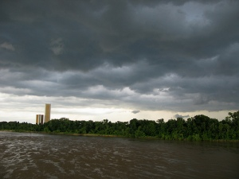

Wiki Wednesday! A few weeks ago, we worked on adding our favorite restaurants with outdoor seating – let’s go a little bit in the opposite direction today and share some things you like to do on a rainy day in Tulsa. We can broaden the definition of “rainy day” to also include “excessively cold and windy day” or “anytime in August”

I visited Skateland for the first time last month on a rainy Saturday. I honestly didn’t know people still roller skate but half of Tulsa was there that day – and my shaky, haven’t-skated-since-my-teen-years legs were trying so hard not to collide with them. I wouldn’t trade that experience for anything, as my five-year-old had a blast, but seriously, give me some more ideas!

Here is how (instructions stolen largely from [John](http://codefortulsa.org/author/jwhitlock918/)’s posts):

1. If you haven’t already, [create your account](http://www.tulsawiki.org/Users/register/ "Create a TulsaWiki account"). If you have a TulsaWiki account, [log in](http://www.tulsawiki.org/Users/login/ "TulsaWiki login") so you’ll get credit for your edits.
2. At the top of the wiki, use ‘Search or create page’ to look for your favorite activity/location.
3. If it’s already on the wiki, use the ‘Edit’ button to add your own expertise to the page. If it isn’t on the wiki, create it, using the Place or Business Template if appropriate. Click 'Save Changes' when you're done.
4. After creating the page, you'll then have the chance to add your location to the map.
5. At the bottom of the page, there is an ‘Edit tags’ button. Add the 'Rainy Day' tag, as well as any others that you think would be useful.
6. Go to the[ Rainy Day tag page](http://www.tulsawiki.org/tags/rainyday "Rainy Day tag page for TulsaWiki") and discover new parts of your town!
