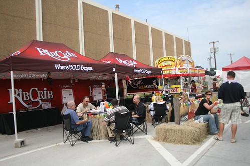

There are ten weeks to go until the National Day of Civic Hacking. We're still working out the details of the event, but we can start creating great content for the [TulsaWiki ](http://www.tulsawiki.org/ "TulsaWiki")today. So, I'd like to announce this week's Wiki Wednesday challenge - places to eat outside!

IMG_7365_1600x1067 / [Les_Stockton](http://www.flickr.com/photos/les_stockton/3931562315/ "IMG_7365_1600x1067 by Les_Stockton, on Flickr") / [CC BY-NC-SA 2.0](http://creativecommons.org/licenses/by-nc-sa/2.0/deed.en "CC BY-NC-SA 2.0")

It's now spring in Tulsa, which means it is snowing one day and beautiful the next. A great way to take advantage of a better day is to enjoy some food and a cool beverage outside. Wouldn't it be great to load up the [Outdoor Seating](http://www.tulsawiki.org/tags/outdoorseating "TulsaWiki - Outdoor Seating") page and see all the restaurants near you with patios and outside tables?

Come add your favorite places:

1. If you haven't already, [create your account](http://www.tulsawiki.org/Users/register/?next=/tags/foodoutsideseating "Create your account"). If you have a TulsaWiki account, [log in](http://www.tulsawiki.org/Users/login/?next=/tags/foodoutsideseating "Log in") so you'll get credit for your edits.
2. At the top of the wiki, use 'Search or create page' to look for your favorite restaurant.
3. If it's already on the wiki, use the 'Edit' button and then add your own expertise to the page, being sure to describe the outdoor seating. If it isn't on the wiki, click the 'Create with Restaurant template' and fill out as much as you can.
4. Add it to the map, so people know where it is.
5. At the bottom of the page, there is an 'Edit tags' button. Make sure the page has the 'Food' and the 'Outdoor Seating' tags. You can add them one at a time, or use the Tab key to split them up.
6. Go to the [Outdoor Seating tag page](http://www.tulsawiki.org/tags/outdoorseating "Tulsa Wiki tag page for Outdoor Seating") and plan where you'll be when the sun is finally shining.

We'll watch the [Recent Changes](http://www.tulsawiki.org/Recent_Changes "Tulsa Wiki - Recent Changes") page to see who is helping out the most on this challenge. If you have ideas for the next challenge, let us know [on the wiki](http://www.tulsawiki.org/Pages_Wanted "TulsaWiki - Pages Wanted") or in the comments. Edit your city!
