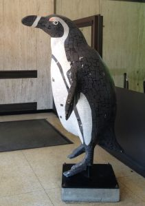

The [Tulsa Zoo](http://www.tulsawiki.org/Tulsa_Zoo "Tulsa Zoo on TulsaWiki") opened their Penguin habitat in 2002, just in time for their 75th anniversary. As part of the four-year fundraising effort, the zoo sold 6-ft tall penguins to local businesses and groups. These groups named and decorated their penguins, and quite a few are still on display all over Tulsa. For this Wiki Wednesday, let's find those penguins!

You probably know of a few penguins near your home, work, or church. If you are having trouble remembering where you saw that penguin, there is a blog, [Tulsa Penguins on Parade](http://tulsapenguinsonparade.blogspot.com/p/locations-growing-list.html "Tulsa Penguins on Parade blog"), which lists the penguins the authors have found. If you have to find them all, the Tulsa Zoo published a book, [Tulsa Zoo's Penguins on Parade](http://www.worldcat.org/title/tulsa-zoos-penguins-on-parade/oclc/62257828 "Tulsa Zoo's Penguins on Parade in Worldcat"), that lists all the names, but maybe not their locations. Ask around - friends or family might know where one of the lost penguins are.

Here's how to participate:

1. Find a penguin! Take a picture, look for the name, and take note of where the penguin is - the street address, as well as what business or place it is near.
2. If you haven’t already, [create your account](http://www.tulsawiki.org/Users/register/ "Create a TulsaWiki account"). If you have a TulsaWiki account, [log in](http://www.tulsawiki.org/Users/login/ "TulsaWiki login") so you’ll get credit for your edits.
3. Go to the [Penguins](http://www.tulsawiki.org/Penguins/ "Penguins on the TulsaWiki") page, and select 'Edit' to start adding your penguin. Add a photo, a name, or a location, or add all three!
4. Save your changes, then click on 'Edit' under the map. Add a marker for where you found your penguin.

With you're help, we'll find all the penguins, and help scavenger hunters and tourists for the next 20 years. While you are out and about, take photos of your favorite parks, restaurants, and other places, and add them to the wiki, or bring them to Tulsa’s [National Day of Civic Hacking](https://ndochtulsa.eventbrite.com/ "NDOCH  registration") on Saturday, June 1, and we'll add them together. Register today!
