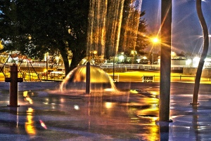

{/**/}

When I was a kid, I was excited about school getting out for about 5 milliseconds, then I immediately fell into a “What am I going to **do** all day?” despair. I didn't know at the time that I wasn't the only one who thought of summer as a season to “survive” rather than one that was inherently amazing. Maybe you’re trying to survive having kids home all day with you, maybe it’s keeping your parents distracted enough when they visit so that they don’t remember what a disappointment you are to them, maybe it is the overwhelming heat. There is plenty to do in and around Tulsa while you wait for [football season](http://www.soonersports.com/sports/m-footbl/spec-rel/112012aaa.html) to return or for [Agents of S.H.I.E.L.D.](http://shieldtv.net/) to premiere.

First, you can register for the [National Day of Civic Hacking - Tulsa](http://ndochtulsa.eventbrite.com/) if you haven’t already. June 1st is covered!

You could go on a [Penguin Hunt](http://codefortulsa.org/2013/05/15/ww-penguin-hunt/). Or hang out in the water at [Big Splash](http://www.tulsawiki.org/Big_Splash) or [LaFortune Park’s](http://www.tulsawiki.org/LaFortune_Park) swimming pool. And, of course, participate in the [Tulsa Library’s Summer Reading Program](http://kids.tulsalibrary.org/whatshappening/events/10_summer-reading.php)!

Wiki your summer plans, and let the [Wiki](http://www.tulsawiki.org/) help you make some more plans!

Here is how:

1. If you haven’t already, [create your account](http://www.tulsawiki.org/Users/register/). If you have a TulsaWiki account, [log in](http://www.tulsawiki.org/Users/login/) so you’ll get credit for your edits.
2. At the top of the wiki, use ‘Search or create page’ to look for your favorite activity/location.
3. If it’s already on the wiki, use the ‘Edit’ button to add your own expertise to the page. If it isn’t on the wiki, create it, using the Place or Business Template if appropriate. Click 'Save Changes' when you're done.
4. After creating the page, you'll then have the chance to add your location to the map.
5. At the bottom of the page, there is an ‘Edit tags’ button. Add the 'Summer' tag, as well as any others that you think would be useful.
6. Go to the[ Summer tag page](http://www.tulsawiki.org/tags/summer) and discover new parts of your town!

And one more time, remember to register for the [National Day of Civic Hacking - Tulsa](http://ndochtulsa.eventbrite.com/) !

{/*  */}

Photo credit: **[Water Park After Dark](http://www.flickr.com/photos/fixersphotos/7842830410/ "Water Park After Dark"), by [The Fixer](http://www.flickr.com/photos/fixersphotos/ "The Fixer"), [CC BY 2.0](http://creativecommons.org/licenses/by/2.0/deed.en)**
