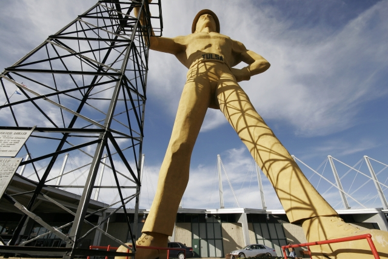

For this Wiki Wednesday, let's create pages on the [TulsaWiki](http://www.tulsawiki.org/ "Tulsa Wiki") for the landmarks. What places belong in the travel guide for Tulsa? What are the features that let you know what part of town you're in? When you've left the state for a while, what sights welcome you back home?

\[caption id="attachment\_177" align="aligncenter" width="640"\] [Golden Driller Tulsa](http://www.flickr.com/photos/ourtulsaworld/402952780/) / David Schuttler / [CC BY-NC-ND 2.0](http://creativecommons.org/licenses/by-nc-nd/2.0/deed.en)\[/caption\]

You might be imagining the stores and signs along Route 66, or the Art Deco reminders of the oil boom. Maybe you've pictured the sculptures, like the Praying Hands or the Artificial Cloud. You could be thinking of a crowded park on a hot day, like the 41st Street Plaza or the Guthrie Green. Or maybe you have a connection to a smaller site, or one that isn't here anymore, that speaks to your personal history in this town.

Come add _your_ landmarks:

1. If you haven’t already, [create your account](http://www.tulsawiki.org/Users/register/?next=/tags/landmark "Create a TulsaWiki account"). If you have a TulsaWiki account, [log in](http://www.tulsawiki.org/Users/login/?next=/tags/landmark "TulsaWiki login") so you’ll get credit for your edits.
2. At the top of the wiki, use ‘Search or create page’ to look for your favorite landmark.
3. If it’s already on the wiki, use the ‘Edit’ button to add your own expertise to the page. If it isn’t on the wiki, create it, using the Place or Business Template if appropriate. Click 'Save Changes' when you're done.
4. After creating the page, you'll then have the chance to add your landmark to the map.
5. At the bottom of the page, there is an ‘Edit tags’ button. Add the 'Landmark' tag, as well as any others that you think would be useful.
6. Go to the [Landmark tag page](http://www.tulsawiki.org/tags/landmark "TulsaWiki tag page for landmarks") and discover new parts of your town!

If you need further inspiration, check out [Visit Tulsa](http://www.visittulsa.com/), [Trip Advisor](http://www.tripadvisor.com/Attractions-g51697-Activities-Tulsa_Oklahoma.html "TripAdvisor activities in Tulsa"), and [Wikipedia](http://en.wikipedia.org/wiki/Tulsa,_Oklahoma). Please don't copy and paste - we want your words and your images.

Watch the [Recent Changes](http://www.tulsawiki.org/Recent_Changes) page to see what people are adding. If you have an idea for the next challenge, let us know [on the wiki](http://www.tulsawiki.org/Pages_Wanted) or in the comments. Edit your city!
